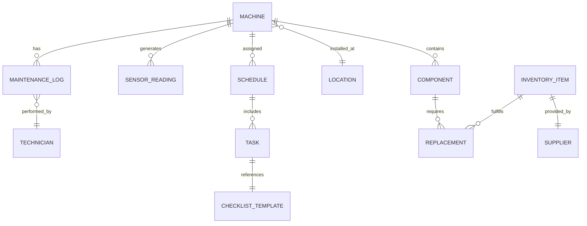
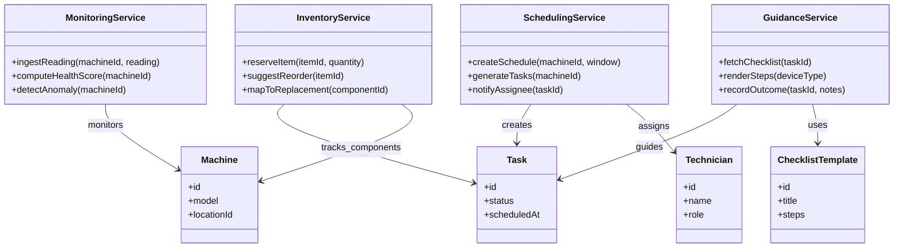

# Coffee Maintenance Assistant

## Introduction
The Coffee Maintenance Assistant is a conceptual platform that keeps espresso machines healthy through proactive maintenance, guided troubleshooting, and insight-driven scheduling. It blends sensor inputs, maintenance logs, and user guidance to minimize downtime while extending machine lifespan.

### Vision
- Prevent unexpected breakdowns by monitoring machine health and prompting timely interventions.
- Provide concise, guided workflows for cleaning cycles, descaling, and part replacements.
- Offer dashboards and notifications that help technicians prioritize work across multiple locations.

### Core Use Cases
- **Daily upkeep:** Prompt baristas through checklists for cleaning, purging, and backflushing.
- **Predictive maintenance:** Analyze sensor trends (temperature, pressure, flow, TDS) to forecast descaling or gasket replacement needs.
- **Spare part readiness:** Track component lifetimes and inventory levels to alert when stock falls below thresholds.
- **Remote troubleshooting:** Provide guided decision trees and step-by-step diagnostics before dispatching a technician.

## System Overview
The assistant revolves around three pillars: monitoring, planning, and guidance. Devices stream telemetry to the platform, which evaluates rules and models to propose maintenance actions. Schedules, inventories, and historical logs inform when and how to service each machine, while a mobile-friendly interface walks users through the tasks.

## Entity Relationship Diagram

### Entity Notes
- **Machine:** Uniquely identified device with model details and installation date.
- **Sensor Reading:** Telemetry events (timestamp, type, value, status) enabling health scoring.
- **Schedule/Task:** Planned maintenance windows containing granular tasks aligned to checklists.
- **Maintenance Log:** Completed actions with technician, duration, parts used, and outcomes.
- **Component/Replacement:** Wear parts with expected lifespan and links to inventory fulfillments.
- **Inventory Item:** Stock-keeping unit with supplier, quantity, reorder level, and lead time.

## UML Overview (Class Diagram)

### Interaction Flow (Example)
1. Sensors stream readings to **MonitoringService**, which computes health scores and flags anomalies.
2. When thresholds are crossed, **SchedulingService** generates maintenance tasks and assigns technicians.
3. Technicians open tasks on mobile; **GuidanceService** retrieves the checklist and records outcomes.
4. If parts are needed, **InventoryService** reserves items and triggers reorder suggestions.

## Future Enhancements
- Machine learning-based failure prediction using historical logs.
- AR-guided maintenance steps for technicians on-site.
- Bidirectional IoT control to run automated flushes or rinses remotely.
